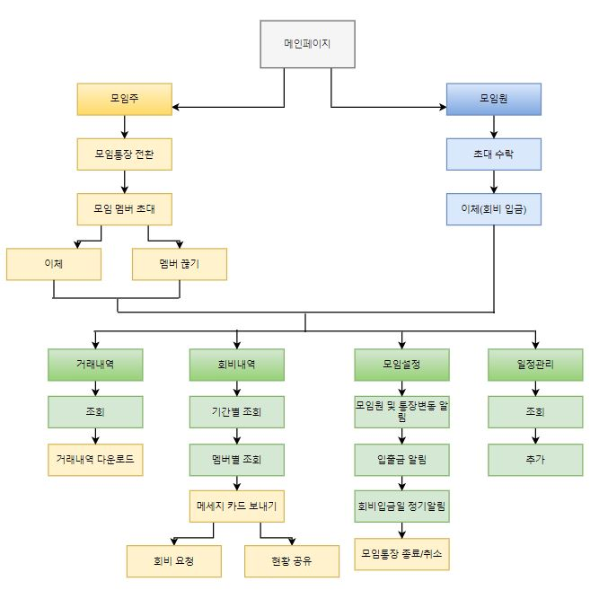

# 프로젝트 제목

[프로젝트 홈페이지 - https://koposoftware.github.io/2020_10_mhhan/](https://koposoftware.github.io/2020_10_mhhan/)

# 1. 프로젝트 개요

  
금융 시장 경쟁이 심해짐에 따라 차별화된 서비스로 모든 접점에서 고객 경험을 개선하여 신규 손님을 유입해야 합니다. 그리고 이를 수행할 수 있는 효율적인 유도 수단으로 모임통장이 가장 적합하다고 생각했습니다. 실제 모임통장 서비스를 제공하는 타 은행에 따르면 모임통장 평균 멤버 수는 3.7명이며, 계좌가 없던 모임통장 멤버가 계좌개설 고객으로 전환하는 비율은 44%라고 합니다. 1개의 모임통장에 대해 평균 3.7명에게 편리한 고객 경험을 제공하여 그 중 44%를 실제 하나은행 손님으로 전환시킬 수 있기 때문에 그것을 뒷받침할 수 있는 차별화된 모임통장 서비스를 구현했습니다.
 

# 2. 프로젝트 제안서

## 2-1. 발표 자료   
[하나은행 모임통장 서비스 제안서](/hanamoim_final_presentation_한미희.pdf) 
## 2-2. 시스템 아키텍쳐 및 ERD
 
 

 

# 3. 프로젝트 결과

## 3-1. 발표 자료 
   [발표자료 pdf](/hanamoim_final_presentation_한미희.pdf) 
    

## 3-2. 시연 동영상 

<iframe width="560" height="315" src="https://youtu.be/XWWyynm9Nng" frameborder="0" allow="accelerometer; autoplay; clipboard-write; encrypted-media; gyroscope; picture-in-picture" allowfullscreen></iframe>
   
## 3-3. 하나모임 프로젝트 요약

### 수행기간

2020.09.02 ~ 2020.10.06
 

### 담당 업무

요구사항 분석, 목업 구상, DB 모델링, 기능 설계 및 구현
 

### 사용기술

Spring MVC 기반 웹 애플리케이션 제작 
카카오링크 API 초대 메세지, 메세지카드 발송 
SMS API 통장변동 알림, 입출금알림, 회비입금 알림 
Spring Scheduler 모임통장 종료, 회비입금 알림 
Apache POI 거래내역 다운로드 
FullCalendar 일정관리 
 

### 개발 환경

JDK 1.8, Window10, Oracle 12.2.0.1, Tomcat9
 

### Language / Tool / DB

Language : HTML, CSS, Javascript, Python, Java 
Framework : Spring, MyBatis, Bootstrap 
Database : Oracle DBMS 
Server : Tomcat 
Etc : Git(Git Bash)
 

### 워크플로우
 
 
 
### 기대효과

한 명이 모임통장을 만들면 여러 명의 모임 멤버에게 서비스를 제공할 수 있다는 특성 상 2가지 효과를 기대해볼 수 있습니다. 
첫째, 편리한 고객 경험을 바탕으로 하나은행에 대한 긍정적인 인식을 형성하여 기존 손님들의 충성도는 상승시키고 잠재적인 손님을 형성할 수 있습니다.  
둘째, 모임 멤버들은 회비를 하나은행에 입금하기 때문에 수신에 도움이 됩니다.  
 

### 보완점
1.개인정보처리 
2.동시 접속자 / 모임통장 인원 확장 
3.플랫폼 확장 
 

# 4. 본인 소개

|이름 |한미희||
|연락처 | answer_lm(@).com|
|skill set| Frontend - HTML, CSS, Javascript|
| | Backend - Java, Spring, Oracle|
 
